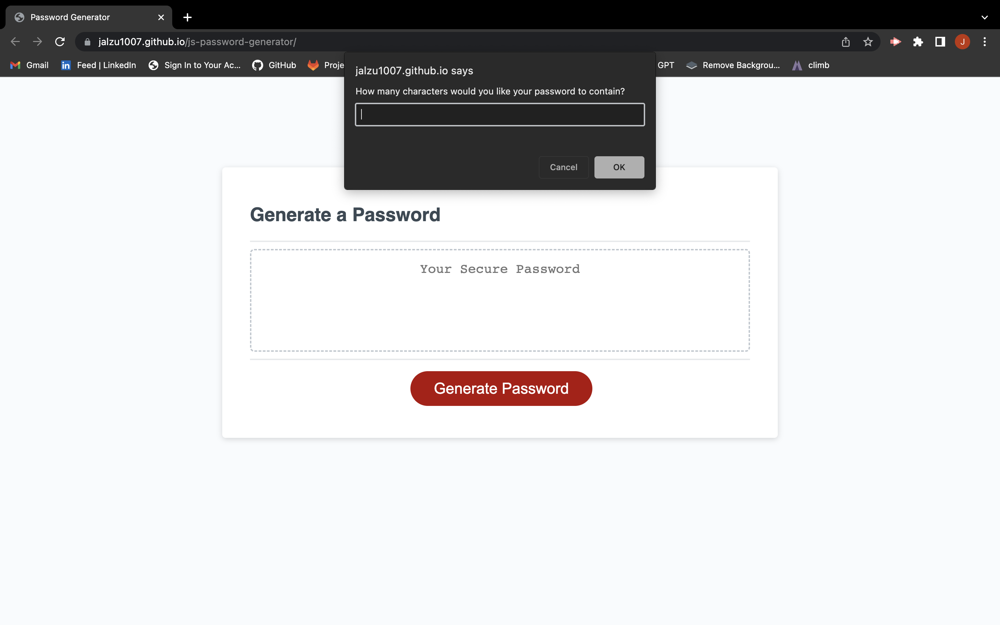
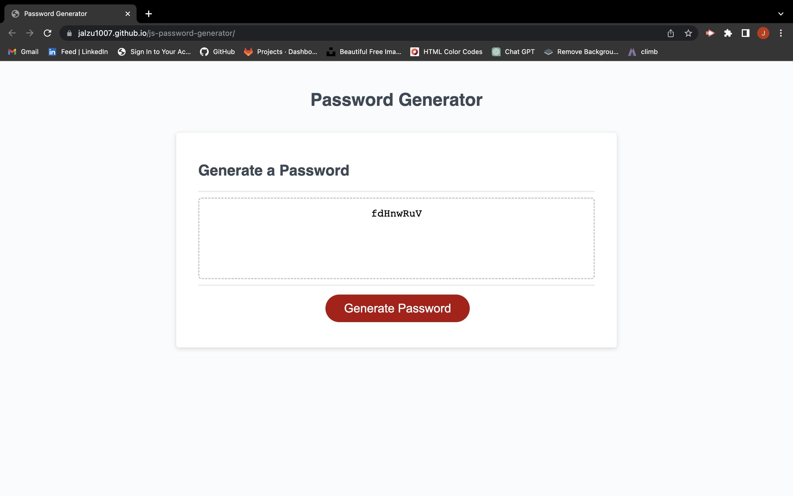

# js-password-generator

## Description
 
 This project is a web application that allows users with access to sensitive data to generate random passwords based on criteria they select. The motivation behind this project is to create a tool that enables users to create strong passwords that provide greater security for sensitive data.

 This project solves the problem of weak passwords that are easily guessed or hacked, which can lead to security breaches and compromised data. During the development of this project, I learned how to create a responsive user interface, use JavaScript to generate random passwords, and validate user input.

## Installation

To install this project, follow these steps:

1. Clone the repository on your local machine using the following command:

git clone https://github.com/Jalzu1007/js-password-generator.git

2. Navigate to the repository's directory using the command:

 cd js-password-generator

3. Open the index.html file in your web browser to view the webpage.

## Usage

To use the JavaScript Password Generator, follow these steps:

1. Open the index.html file in your web browser.
2. Click the "Generate Password" button.
3. Enter a password length between 8 and 128 characters when prompted.
4. Confirm whether or not to include lowercase, uppercase, numeric, and special characters in the password.
5. Ensure that at least one character type is selected.
6. A password will be generated that matches the selected criteria and will be displayed on the page.

Deployed website:

https://jalzu1007.github.io/js-password-generator/

Screenshot of the password generator:

   

## Credits

I used the following third-party assets in this project:

- https://miavirtfsfpt0-geu5120.slack.com/files/U04V685D8J3/F053U6VSHSL/javascript-cheatsheet-books.pdf
- https://javascript.info/logical-operators
- https://www.tutorialrepublic.com/javascript-tutorial/javascript-loops.php
- https://www.javascripttutorial.net/javascript-function/
- https://javascript.info/array-methods
- https://javascript.info/object
- https://youtu.be/BrQKPm1Uchc
- https://www.youtube.com/watch?v=HXNhEYqFo0o
- https://youtu.be/BRSg22VacUA
- https://youtu.be/rLPwCAqyCAE
- https://www.youtube.com/watch?v=IsG4Xd6LlsM
- https://eloquentjavascript.net/

## License

N/A

